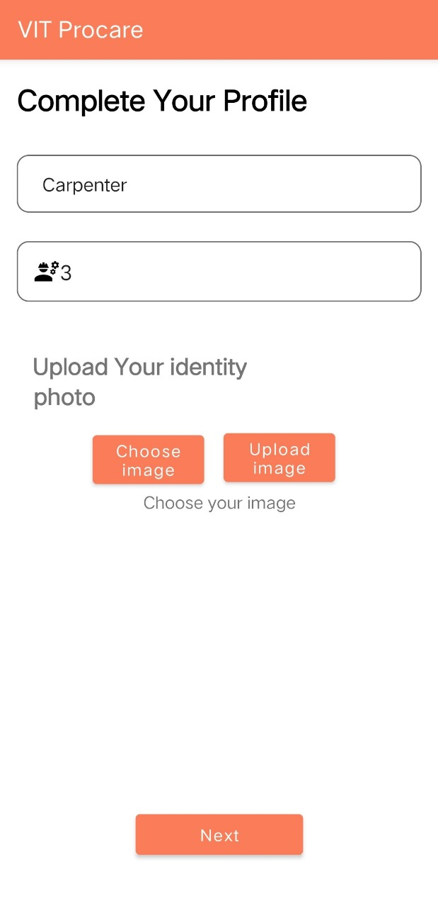
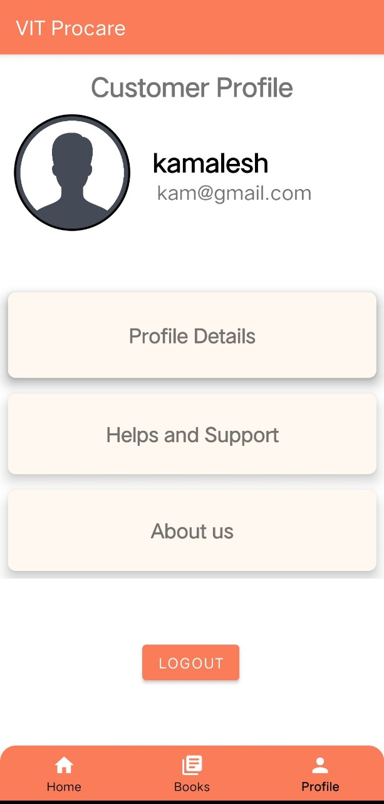

# ProCare-App

ProCare is an Android app developed during the Startupthon hackathon to provide a reliable and efficient platform for utility maintenance services. The app simplifies the process of finding verified professionals like electricians, plumbers, and carpenters, ensuring standardized pricing and consistent service quality. This repository includes the app's APK file for installation, the presentation used for pitching the idea, and a demonstration video showcasing the app's features.

Built using Java for functionality and XML for the UI, ProCare was developed in Android Studio. Firebase was integrated for account authorization and database management, ensuring secure and seamless user interactions. Additionally, the app uses the Google Maps API to enable location-based services and real-time tracking of service providers. ProCare addresses challenges like trust, time efficiency, and transparency in the utility maintenance sector, offering a user-friendly interface and comprehensive service options. Future plans include adding advanced features like automated scheduling and expanding to multiple cities.

This is the app's loading screen, displaying the ProCare branding.
 
This is the Sign-In page, where users can log in to access the app's services.

This is the Sign-Up page, where users can register as either a customer or a service provider. Service providers undergo additional authentication. 
 
This is the Main Page of the app, where users can select one of the four services: electrician, plumber, carpenter, or pest control.
 
This screen allows service providers to describe their services and set their prices.
 
This screen shows a customer sending a service request for pest control, marking the location on the map. 
 
This screen shows a service provider viewing the customer's request, with options to accept or reject it.
 
This is the Profile Page, where users can view and update their personal information and preferences
 
This is the Settings Page, providing access to various configurations

These images showcase a selection of the app's key features, highlighting its functionality and user experience. The app includes additional features beyond those depicted here.
