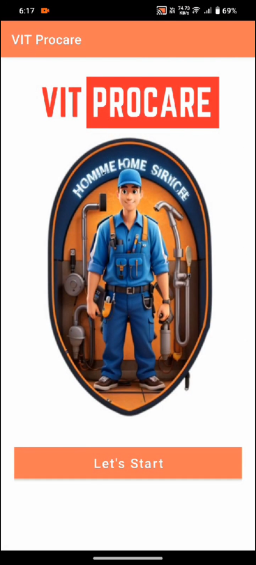
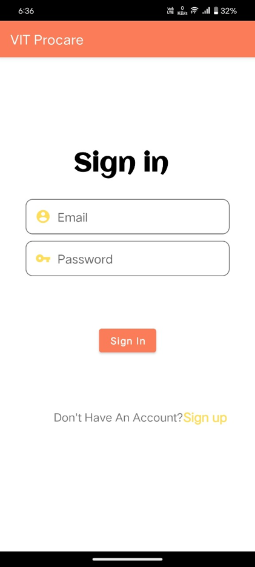
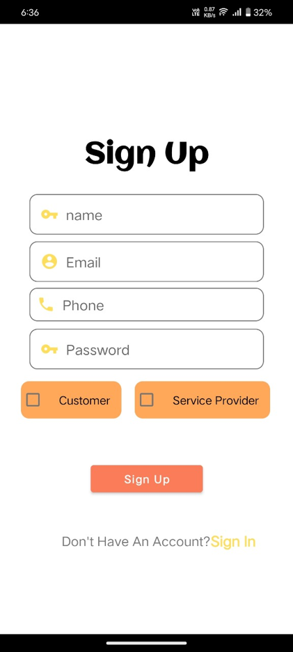
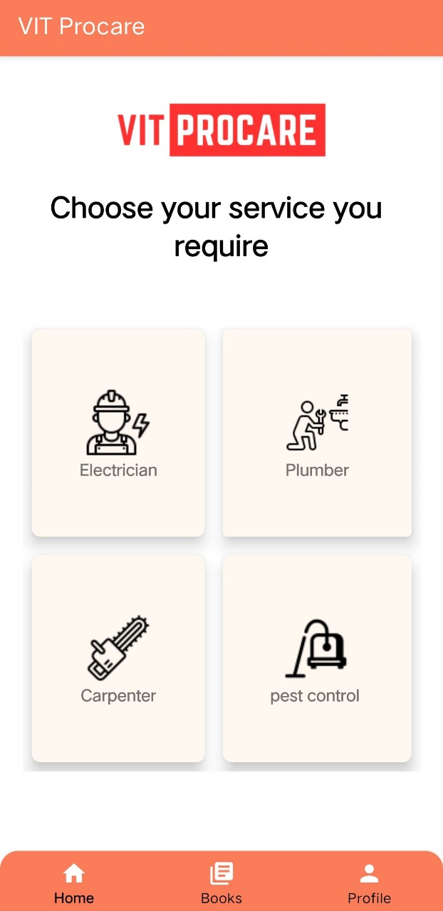
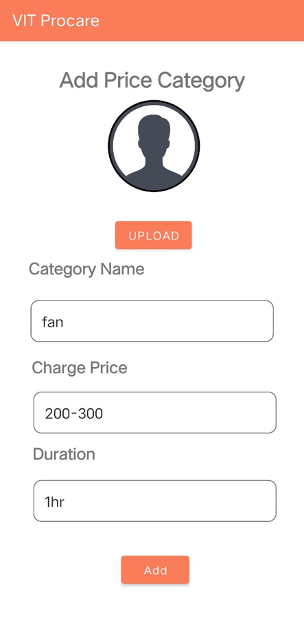
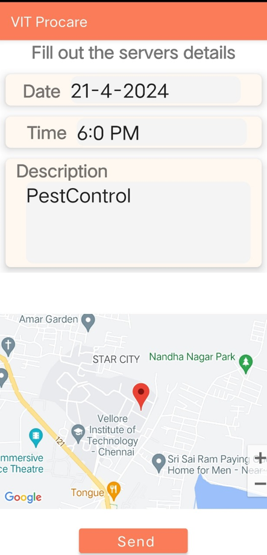
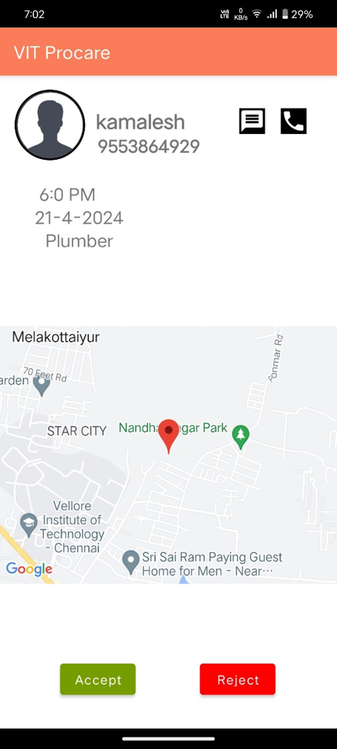

# ProCare-App

ProCare is an Android app developed during the Startupthon hackathon to provide a reliable and efficient platform for utility maintenance services. The app simplifies the process of finding verified professionals like electricians, plumbers, and carpenters, ensuring standardized pricing and consistent service quality. This repository includes the app's APK file for installation, the presentation used for pitching the idea, and a demonstration video showcasing the app's features.

Built using Java for functionality and XML for the UI, ProCare was developed in Android Studio. Firebase was integrated for account authorization and database management, ensuring secure and seamless user interactions. Additionally, the app uses the Google Maps API to enable location-based services and real-time tracking of service providers. ProCare addresses challenges like trust, time efficiency, and transparency in the utility maintenance sector, offering a user-friendly interface and comprehensive service options. Future plans include adding advanced features like automated scheduling and expanding to multiple cities.

